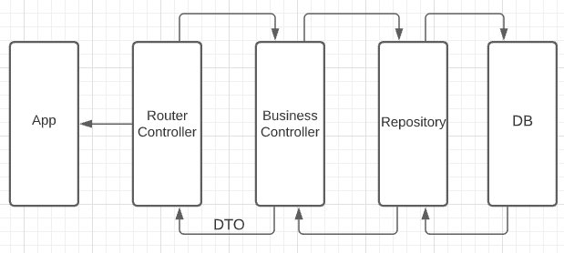

# Shipping App

This project runs using Node v12.22.1 and mysql 8.0.25

<hr>

## Architecture



### 1) Within each module(in this case we only have 1 Module) there is a router that is responsible for correctly managment of the request, working between the APP and the Router Controller.

<br>

### 2) Our Router controller handles our request, and will return the responses, with their corresponding status(200 OK || 400 Error). Its connected with our Business Controller.

<br>

### 3) Our Business Controller is where we apply our Business Logic.Its the only one who can call our repositories method. When the Business Controller gets a reponse from our repository,transforms that reponse into an DTO and send it to the Router Controller.

<br>

### 4) The Repository is the last layer of our App. Its the only one who has direct access to the database through queries.

<hr>

## How to run the project

1. Install project dependencies:

    ``` 
    npm install
    ```
2. Create the .env file with the following variables:

    ``` 
    DB_HOST=localhost
    DB_NAME=yourDbName
    DB_USER=yourUserName
    DB_PASSWORD=yourPassowrd

    PORT=PortNumber
    ```

3. Run the script to create the database:

    ```
    npm run db:create
    ```

4. Script to run the project:

    ```
    npm run dev
    ```
<hr>  

### Endpoints:

<br>

#### POST -> /shipping/

<br>

1. Send for body at json format:

    ```
    {
        "customer": "customer1",
        "descrip":"lorem ipsum",
        "origin_lat": 1.223456,
        "origin_long": 1.43425,
        "end_lat": 1.2,
        "end_long":1.5
    }
    ```
    Lets get this response:

    ```
    {
        "customer": "customer1",
        "descrip": "lorem ipsum",
        "status": "Pendiente",
        "aprox_distance": 0.069808641,
        "origin_lat": 1.223456,
        "origin_long": 1.43425,
        "current_lat": 1.223456,
        "current_long": 1.43425,
        "end_lat": 1.223456,
        "end_long": 1.5
    }
    ```

<br>

#### GET -> /shipping/1  where 1 is the id of the shipment

<br>

    {
        "customer": "customer1",
        "descrip": "lorem ipsum",
        "status": "Pendiente",
        "aprox_distance": 0.0698086
    }

<br>

#### PUT -> /shipping/id

1. Here we can update current_lat, current_long, status of our shipment.
    
    ```
    {
        "current_lat": 5.42313,
        "current_long": 5.1123
    }
    ```

    ```
    Updated Shipping
    ```

2. If we update the status to "Entregado":

    ```
    {
        "customer": "customer1",
        "descrip": "lorem ipsum",
        "status": "Entregado",
        "aprox_distance": 0,
        "origin_lat": "1.22345600",
        "origin_long": "1.43425000",
        "current_lat": "1.22345600",
        "current_long": "1.43425000",
        "end_lat": "1.22345600",
        "end_long": "1.50000000",
        "finish_at": "Wed, 09 Jun 2021 20:24:36 GMT"
    }
    ```

3. The Status of our Shipment only can be updated to "En Proceso","Cancelado","Entregado". When we create a new Shipment, the status automatically switches to "Pendiente"